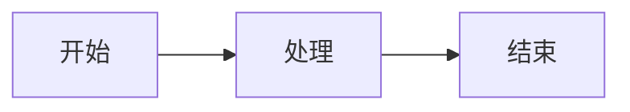

# HeiBan - Mermaid转HTML幻灯片生成器

[English](README_EN.md) | 中文


一款基于PySide6的桌面应用，用于将Markdown文档（含Mermaid图表）转换为reveal.js格式的HTML幻灯片，并支持导出为PDF。

## 特性

### 核心功能
- **Markdown转幻灯片** - 使用`---`分隔幻灯片，支持标题、列表、代码块、表格等
- **Mermaid图表** - 自动识别并渲染流程图、时序图、甘特图等
- **代码高亮** - GitHub风格代码高亮，支持多种编程语言
- **数学公式** - 支持KaTeX数学公式渲染（`$...$` 和 `$$...$$`）

### 主题支持
- **暗色/亮色主题** - 完整的深色和浅色主题支持
- **自定义设置** - 可调整字体大小、宽高比、Mermaid主题等
- **样式保留** - PDF导出完美保留所有样式（背景色、文字颜色等）

### 导出功能
- **HTML导出** - 生成自包含的HTML文件，无外部依赖
- **PDF导出** - 使用Qt内置功能生成PDF，保留所有样式
- **自动分页** - 每张幻灯片自动分成一页

## 安装

### 从PyPI安装

```bash
pip install heiban
```

### 从源码安装

```bash
git clone https://github.com/yourusername/HeiBan.git
cd HeiBan
pip install -e .
```

## 使用方法

### GUI模式

```bash
heiban
```

#### GUI功能说明

1. **打开Markdown文件** - 加载`.md`文件
2. **保存HTML文件** - 导出为自包含的HTML幻灯片
3. **导出PDF** - 生成PDF文件，完美保留样式

#### 设置菜单

- **宽高比** - 16:9（宽屏）、4:3（普屏）、21:9（超宽）、3:2（标准）
- **字体大小** - 16px 到 40px
- **Mermaid主题** - default、neutral、dark、base
- **代码高亮主题** - dark（暗色）、light（亮色）

### 命令行模式

```bash
# 基本用法
heiban input.md -o output.html

# 指定尺寸
heiban input.md --width 1920 --height 1080

# 查看帮助
heiban --help
```

## Markdown格式示例

```markdown
# 演示标题

## 第一页：列表和代码

- 列表项1
- 列表项2
- 列表项3

```python
def hello():
    print("Hello, World!")
```

---

## 第二页：Mermaid图表



---

## 第三页：表格和公式

| 项目 | 数量 | 价格 |
|------|------|------|
| A    | 10   | $100 |
| B    | 20   | $200 |

数学公式：$E = mc^2$

$$
\int_0^\infty e^{-x^2} dx = \frac{\sqrt{\pi}}{2}
$$
```

## 项目结构

```
heiban/
├── heiban/
│   ├── __init__.py          # 包初始化
│   ├── converter.py         # 转换器核心
│   ├── gui.py               # GUI界面
│   └── data/
│       └── lib/             # JS/CSS资源文件
│           ├── js/
│           │   ├── reveal.min.js
│           │   ├── mermaid.min.js
│           │   ├── highlight.min.js
│           │   └── katex.min.js
│           └── css/
│               ├── reveal.min.css
│               ├── katex.min.css
│               └── ...
├── tests/                   # 测试文件
├── pyproject.toml          # 项目配置
└── README.md               # 说明文档
```

## 技术栈

### 前端技术
- **reveal.js** - 幻灯片框架
- **Mermaid** - 图表渲染
- **highlight.js** - 代码高亮
- **KaTeX** - 数学公式渲染

### 后端技术
- **Python 3.8+** - 核心语言
- **PySide6** - Qt GUI框架
- **Qt Print Support** - PDF生成

## 开发

### 安装开发依赖

```bash
pip install -e ".[dev]"
```

### 运行测试

```bash
pytest tests/ -v
```

### 代码检查

```bash
ruff check .
ruff format .
```

## 依赖要求

- Python >= 3.8
- PySide6 >= 6.5.0

## 已知限制

1. **PDF导出** - 不支持JavaScript动画效果，Mermaid图表需要预先渲染
2. **资源大小** - 生成的HTML文件较大（约4MB），因为包含所有JS/CSS资源
3. **浏览器兼容** - 推荐使用现代浏览器（Chrome、Firefox、Safari）

## 更新日志

### v0.1.32 (2026-04-09)
- 修复PDF导出枚举类型错误
- 改进Qt打印功能
- 优化错误处理

### v0.1.30 (2026-04-09)
- 简化GUI界面，移除预览Tab
- 使用Qt QTextDocument生成PDF
- 完善文档

### v0.1.28 (2026-04-09)
- 完整实现暗色主题
- 修复reveal.js默认样式覆盖问题
- 改进表格样式

## 许可证

GPL-3.0-or-later

## 贡献

欢迎提交Issue和Pull Request！

## 联系方式

- 项目地址：https://github.com/yourusername/HeiBan
- 问题反馈：https://github.com/yourusername/HeiBan/issues