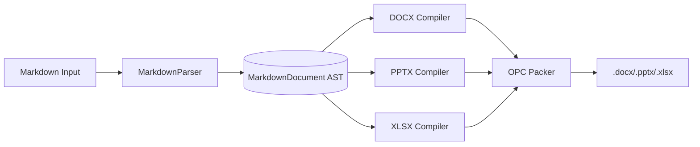

# HeiBan 全功能演示

这是一个涵盖 HeiBan 所有 Markdown 特性的测试文档。

## 文本样式

这段文字包含 **粗体**、*斜体*、`行内代码`、~~删除线~~，以及 [超链接](https://github.com/cycleuser/HeiBan)。

## 代码块

```python
def fibonacci(n: int) -> list[int]:
    """Generate Fibonacci sequence up to n."""
    a, b = 0, 1
    result = []
    while a <= n:
        result.append(a)
        a, b = b, a + b
    return result

print(fibonacci(100))
```

## 表格

| 优先级 | 功能 | 状态 |
|--------|------|------|
| P0 | DOCX 生成 | ✅ |
| P0 | PPTX 生成 | ✅ |
| P1 | XLSX 生成 | ✅ |
| P2 | 图片支持 | 🔄 |
| P3 | 公式渲染 | 🔄 |

## 列表

### 无序列表

- 核心模块
  - core/
    - xml_utils.py
    - opc.py
    - converters.py
  - markdown/
    - ast_nodes.py
    - parser.py
- 编译器模块
  - docx/
  - pptx/
  - xlsx/

### 有序列表

1. 解析 Markdown → AST
2. 创建 WriteContext
3. 编译 AST → XML Parts
4. 组装 ZIP → 输出文件

## 引用

> The best way to predict the future is to invent it.
> — Alan Kay

> Clean code always looks like it was written by someone who cares.
> — Robert C. Martin

## 数学

$E = mc^2$

$$
\sum_{k=1}^{n} k = \frac{n(n+1)}{2}
$$

## 架构图


