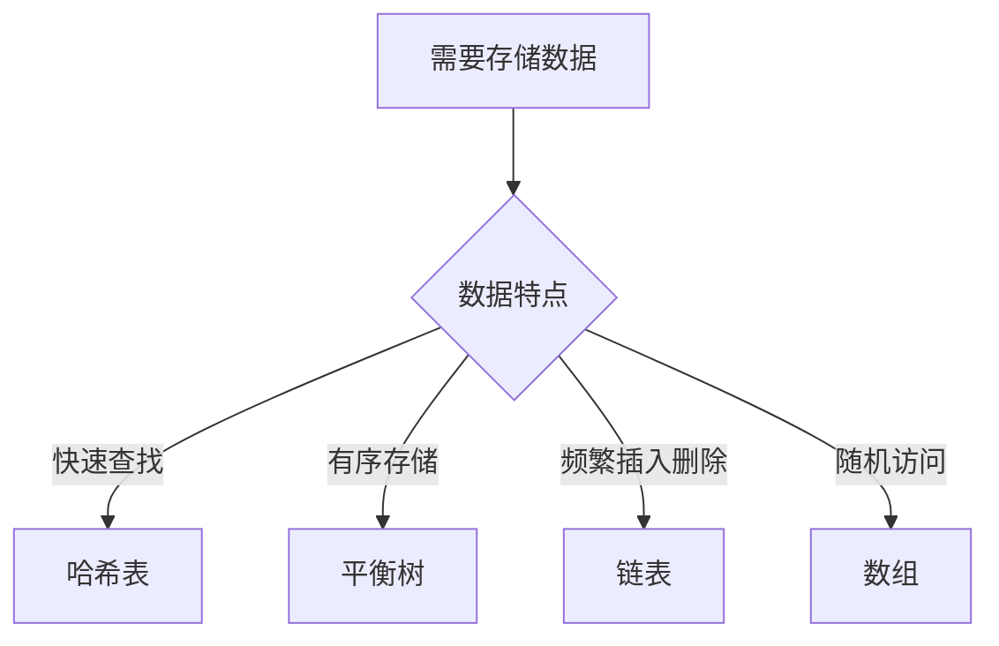

# HeiBan 测试演示

## 项目简介

HeiBan 是一个将 **Markdown** 转换为 **reveal.js** 幻灯片的工具，支持：

- 代码高亮（暗色/亮色主题）
- Mermaid 流程图
- 数学公式
- 表格
- 自动分页

---

## 代码块测试

### C 语言示例

```c
#include <stdio.h>
#include <stdlib.h>

int factorial(int n) {
    if (n <= 1) return 1;
    return n * factorial(n - 1);
}

int main() {
    int num = 5;
    printf("Factorial of %d is %d\n", num, factorial(num));
    return 0;
}
```

---

### Python 示例

```python
def quicksort(arr):
    """快速排序实现"""
    if len(arr) <= 1:
        return arr
    pivot = arr[len(arr) // 2]
    left = [x for x in arr if x < pivot]
    middle = [x for x in arr if x == pivot]
    right = [x for x in arr if x > pivot]
    return quicksort(left) + middle + quicksort(right)

# 测试
data = [3, 6, 8, 10, 1, 2, 1]
print(quicksort(data))
```

---

## 流程图测试

### 程序编译流程


---

### 数据结构选择



---

## 数学公式测试

### 基础公式

欧拉公式：$e^{i\pi} + 1 = 0$

勾股定理：$a^2 + b^2 = c^2$

二次方程求根公式：$x = \frac{-b \pm \sqrt{b^2 - 4ac}}{2a}$

---

### 复杂公式

傅里叶变换：

$$F(\omega) = \int_{-\infty}^{\infty} f(t) e^{-i\omega t} dt$$

高斯分布：

$$f(x) = \frac{1}{\sigma\sqrt{2\pi}} e^{-\frac{(x-\mu)^2}{2\sigma^2}}$$

矩阵运算：

$$\begin{bmatrix} a & b \\ c & d \end{bmatrix} \begin{bmatrix} x \\ y \end{bmatrix} = \begin{bmatrix} ax + by \\ cx + dy \end{bmatrix}$$

---

## 表格测试

| 语言 | 类型 | 特点 | 应用场景 |
|------|------|------|----------|
| **C** | 编译型 | 高性能、底层控制 | 系统编程、嵌入式 |
| **Python** | 解释型 | 简洁、丰富库 | 数据科学、AI |
| **JavaScript** | 脚本型 | 动态、跨平台 | Web开发 |
| **Rust** | 编译型 | 内存安全 | 系统工具 |

---

## 列表测试

### 无序列表

- 第一项：支持**粗体**和*斜体*
- 第二项：支持`行内代码`
- 第三项：支持普通文本
- 第四项：支持混合**粗体`代码`文本**

### 有序列表

1. 数据预处理
2. 特征提取
3. 模型训练
4. 模型评估
5. 部署上线

---

## 综合示例

### 算法复杂度对比

```mermaid
flowchart TB
    subgraph "时间复杂度"
        O1[O(1) - 常数] --> Ologn[O(log n) - 对数]
        Ologn --> On[O(n) - 线性]
        On --> Onlogn[O(n log n)]
        Onlogn --> On2[O(n²) - 平方]
        On2 --> O2n[O(2^n) - 指数]
    end
```

**空间复杂度公式**：$S(n) = O(n \log n)$

| 算法 | 时间复杂度 | 空间复杂度 |
|------|-----------|-----------|
| 二分查找 | $O(\log n)$ | $O(1)$ |
| 快速排序 | $O(n \log n)$ | $O(\log n)$ |
| 归并排序 | $O(n \log n)$ | $O(n)$ |

---

## 总结

HeiBan 提供了强大的 Markdown 转幻灯片功能：

1. ✅ 完整的 GitHub 风格代码高亮
2. ✅ 暗色/亮色主题切换
3. ✅ Mermaid 流程图支持
4. ✅ 数学公式渲染
5. ✅ 表格和列表支持
6. ✅ 自动分页

**项目地址**：https://github.com/cycleuser/HeiBan

**安装命令**：`pip install heiban`