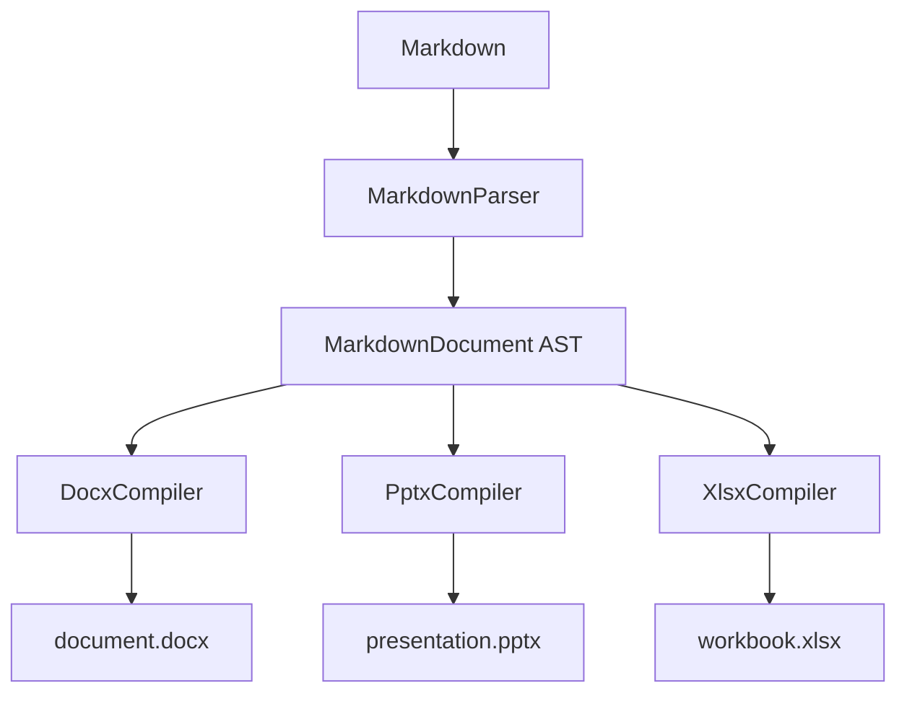

# 欢迎使用 HeiBan

HeiBan 是一个**纯 XML 生成**的 Markdown 转 Office 文档工具。它能够将 Markdown 文本直接转换为 **Word (DOCX)**、**PowerPoint (PPTX)** 和 **Excel (XLSX)** 格式，*无需依赖 python-docx/python-pptx/openpyxl 等第三方 OOXML 库*。

## 核心特性

- **零 OOXML 库依赖** —— 直接生成符合 OOXML 规范的 ZIP + XML
- **Markdown AST** —— 基于 markdown-it-py 的统一中间表示
- **丰富样式** —— 多级标题、代码高亮、彩色表格、引用块
- **图片支持** —— 支持本地文件、URL 和 Base64 内嵌图片
- **数学公式** —— LaTeX 数学公式渲染为 PNG 图片嵌入
- **Mermaid 图表** —— Mermaid 流程图/时序图/甘特图渲染

## 代码示例

下面是一段 Python 代码：

```python
from heiban import generate_docx

markdown_text = """
# My Document

This is a **sample** document with `inline code`.
"""

# 生成 DOCX 文件
docx_bytes = generate_docx(markdown_text)

# 保存到文件
with open("output.docx", "wb") as f:
    f.write(docx_bytes)

print("✓ Document generated successfully!")
```

以及一段 JavaScript 代码：

```javascript
const fs = require('fs');

function processData(items) {
    return items
        .filter(item => item.active)
        .map(item => ({ ...item, processed: true }));
}

const result = processData([
    { id: 1, active: true, value: 42 },
    { id: 2, active: false, value: 99 },
]);

console.log('Result:', JSON.stringify(result, null, 2));
```

## 性能对比表

| 格式 | 生成方式 | 文件大小 | 依赖 | 状态 |
|------|----------|----------|------|------|
| DOCX | 纯 XML 生成 | ~3 KB | 无第三方 OOXML 库 | ✅ 完成 |
| PPTX | 纯 XML 生成 | ~10 KB | 无第三方 OOXML 库 | ✅ 完成 |
| XLSX | 纯 XML 生成 | ~5 KB | 无第三方 OOXML 库 | ✅ 完成 |
| HTML | reveal.js 模板 | ~50 KB | 无 | ✅ 完成 |

## 功能清单

### 已支持

1. **标题** —— H1 到 H6 六级标题，带颜色区分
2. **段落** —— 普通段落，支持**粗体**、*斜体*、`行内代码`、~~删除线~~
3. **超链接** —— 支持 [GitHub](https://github.com/cycleuser/HeiBan) 链接
4. **代码块** —— 带语法高亮的围栏代码块，深色背景
5. **表格** —— GFMarkdown 表格，自动套用彩色样式
6. **列表** —— 有序列表和无序列表，支持嵌套

### 待开发

- 图片内嵌（本地/URL/Base64）
- LaTeX 数学公式渲染
- Mermaid 图表渲染
- 交叉引用和目录
- 页眉/页脚

> **设计理念**：HeiBan 参考了 office-open 的架构思想 —— Descriptor 模式、Compiler→Packer 管线、WriteContext 共享状态、每个 OOXML Part 独立模块。但 HeiBan 使用 Python 实现，更适合 Python 生态。

## 数学公式示例

行内公式：$E = mc^2$

块级公式：

$$
\int_{0}^{\infty} e^{-x^2} dx = \frac{\sqrt{\pi}}{2}
$$

矩阵表示：

$$
\begin{pmatrix}
a & b \\
c & d
\end{pmatrix}
\begin{pmatrix}
x \\
y
\end{pmatrix}
=
\begin{pmatrix}
ax + by \\
cx + dy
\end{pmatrix}
$$

## Mermaid 图表示例



---

## 关于 HeiBan

HeiBan 的名字来源于中文 "黑板"，寓意着像黑板一样简洁、直接地呈现内容。它最初是一个 Markdown 转 reveal.js 幻灯片工具，现在已发展为支持三种 Office 文档格式的全能转换器。

项目地址：https://github.com/cycleuser/HeiBan
