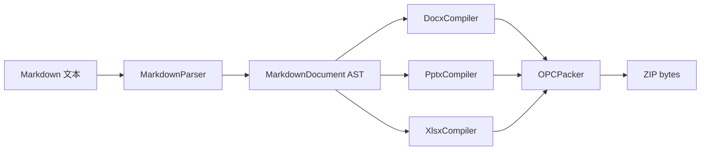

# HeiBan 项目介绍

**Markdown → Office 文档转换器**

纯 XML OOXML 生成 | 零第三方库依赖 | 三种格式支持

---

## 项目背景

### 为什么需要 HeiBan？

在现有的 Markdown 生态中，将 Markdown 转换为 PPTX/DOCX/XLSX 的工具有很多，
但它们大多依赖 **python-pptx**、**python-docx**、**openpyxl** 等第三方 OOXML 库。

HeiBan 的独特之处在于：

- 🔧 **纯 XML 生成** —— 直接构造 OOXML ZIP 包
- 🎯 **统一 AST** —— 一份 Markdown，三种输出
- 🏗️ **清晰架构** —— 参考 office-open 的 Descriptor + Compiler + Packer 管线

---

## 架构设计

### Compiler → Packer 管线



### 目录结构

```
heiban/
├── core/          ← OPC 打包、XML 工具、单位转换
├── markdown/      ← AST 定义 + 解析器
├── docx/          ← Word 编译器
├── pptx/          ← PowerPoint 编译器
├── xlsx/          ← Excel 编译器
└── render/        ← LaTeX/Mermaid/代码渲染
```

---

## 功能特性对比

| 特性 | DOCX | PPTX | XLSX |
|------|------|------|------|
| 标题 H1-H6 | ✅ 彩色层级 | ✅ 自动缩放 | ✅ 加粗标签 |
| 段落文本 | ✅ 完整 | ✅ 自动换行 | ✅ 单元格 |
| 粗体/斜体 | ✅ | ✅ | ❌ |
| 行内代码 | ✅ 灰色底 | ✅ | ✅ 等宽字体 |
| 代码块 | ✅ 深色底 | ✅ 深色底 | ✅ 单单元格 |
| 表格 | ✅ 彩色表头 | ✅ 斑马纹 | ✅ 主功能 |
| 有序列表 | ✅ | ✅ 缩进 | ✅ |
| 无序列表 | ✅ | ✅ 符号 | ✅ |
| 引用块 | ✅ | ✅ 左边框 | ✅ |
| 图片 | ✅ inline | ✅ 缩放 | ❌ |
| 数学公式 | ✅ LaTeX→PNG | ✅ LaTeX→PNG | ❌ |
| Mermaid | ✅ mmdc→PNG | ✅ mmdc→PNG | ❌ |

---

## 代码示例

### Python API

```python
from heiban import generate_docx, generate_pptx, generate_xlsx

markdown = """
# Title
Content here
"""

# 三种格式一次生成
docx = generate_docx(markdown)
pptx = generate_pptx(markdown)
xlsx = generate_xlsx(markdown)
```

### CLI 用法

```bash
# 自动检测格式
heiban input.md -o output.docx

# 从 stdin 读取
echo "# Hello" | heiban - -o out.pptx

# 同时输出 HTML 预览
heiban slides.md -o slides.pptx -f preview.html
```

---

## 数学公式支持

行内公式：$f(x) = \sum_{i=0}^{n} a_i x^i$

块级公式：
$$
\frac{d}{dx}\left( \int_{0}^{x} f(t) dt \right) = f(x)
$$

矩阵乘法：
$$
A \cdot B = \begin{bmatrix}
a_{11}b_{11} + a_{12}b_{21} & a_{11}b_{12} + a_{12}b_{22} \\
a_{21}b_{11} + a_{22}b_{21} & a_{21}b_{12} + a_{22}b_{22}
\end{bmatrix}
$$

---

## 总结与展望

### 已实现

1. ✅ 纯 XML OOXML 生成（DOCX/PPTX/XLSX）
2. ✅ 统一 Markdown AST 中间表示
3. ✅ Compiler→Packer 清晰管线
4. ✅ WriteContext 共享状态管理
5. ✅ 多级标题、代码块、表格、列表
6. ✅ LaTeX 数学公式渲染
7. ✅ Mermaid 图渲染
8. ✅ 统一 CLI 入口

### 未来计划

- 📋 模板/占位符替换（Patch by placeholder）
- 📋 双向解析（parse .docx → MarkdownDocument）
- 📋 AI SDK 集成（类似 office-open 的 Zod + AI tool）
- 📋 图表支持（柱状图、折线图、饼图）
- 📋 页眉/页脚/页码
- 📋 批注和修订跟踪

> **"大道至简"** —— HeiBan 的设计哲学是保持简单、直接、高效。

---

## 感谢

- [office-open](https://github.com/niclin/office-open) —— 架构灵感来源
- [markdown-it-py](https://github.com/executablebooks/markdown-it-py) —— Markdown 解析
- [Python OOXML Community](https://github.com/python-openxml) —— OOXML 规范参考

**项目地址**: https://github.com/cycleuser/HeiBan
